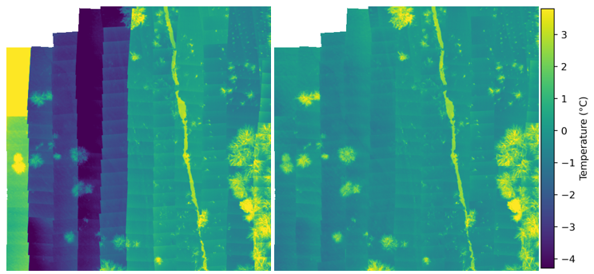

# aerial-thermal-tuner
 \
A mosaic of thermal images before and after calibration.
## Overview
Thermal images taken with uncooled thermal cameras are characterized by large measurement uncertainties related to drift of measurement values and vignette effects. The presented solution offsets these effects by using a single image vignette correction algorithm and an optimization process based on minimizing the value offset between overlapping images using PyTorch Gradient Descent.

*Iplementation of the Single Image Vignette Correction algorithm is based on MATLAB code available on https://github.com/GUOYI1/Vignetting_corrector* \
*The image georeferencing used in this solution is based on the code available at https://github.com/luna983/stitch-aerial-photos/tree/master/src*

## File structure
The solution consists of steps that are implemented in separate notebooks:
- *1_conversion.ipynb* - convert the thermal camera manufacturer's specific image format to TIFF containing temperatures as float32 numbers.
- *2_devignetting.ipynb* - devignetting using single image algorithm.
- *3_georeferencing.ipynb* - image georeferencing using initial GPS metadata and further georeferencing accuracy improvement using OpenCV stitching and PyTorch optimization.
- *4_calibration.ipynb* - improvement of thermal values precision by minimization of a bias between overlapping images.
- *5_offsetting.ipynb* - improvement of thermal values accuracy by applying offset based on thermometer measurement.

## Running the solution
Please see *Dockerfile* to run the Docker container on any operating system.

On Windows you can run *env.bat* to automatically create and run the container.
